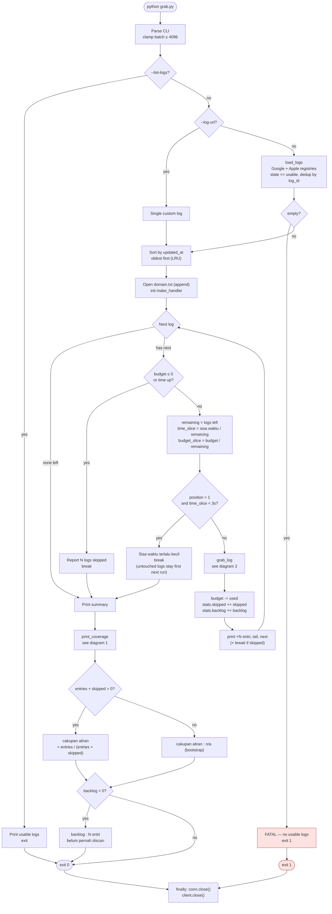
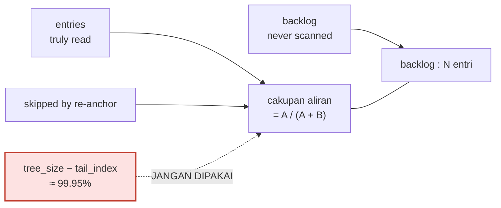
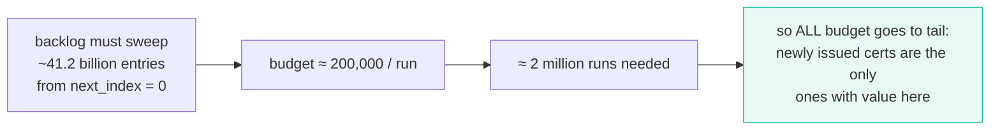
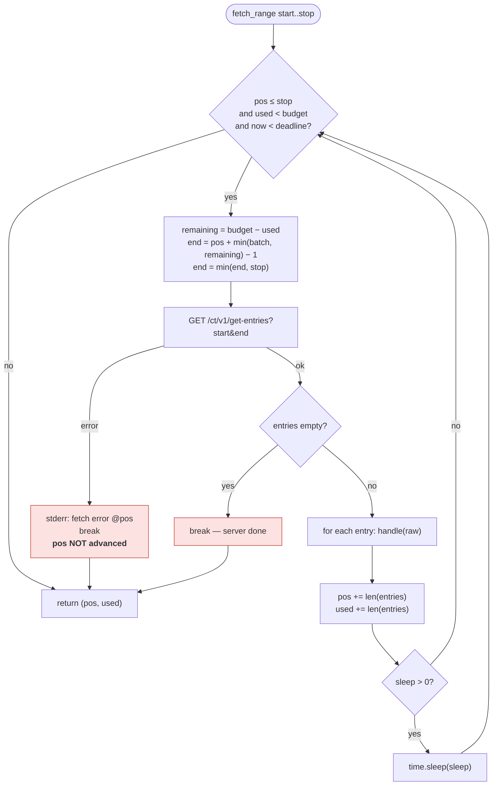
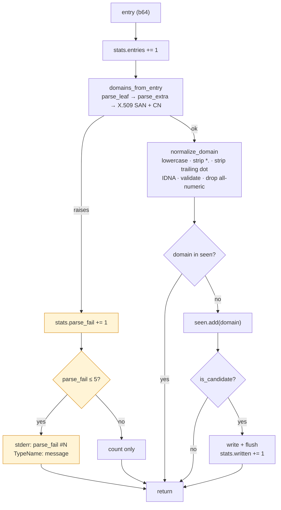
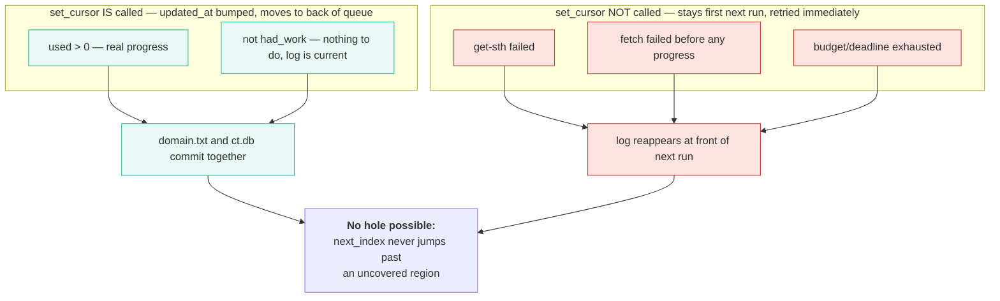
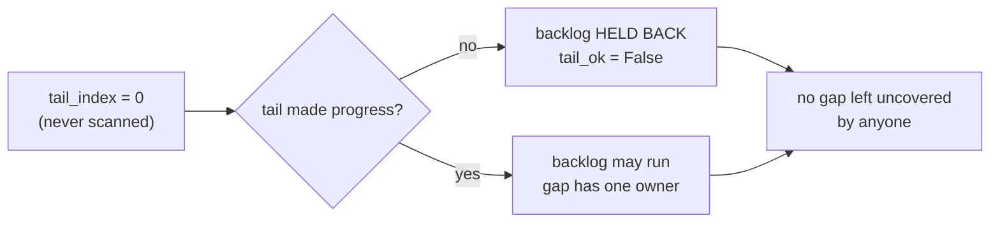
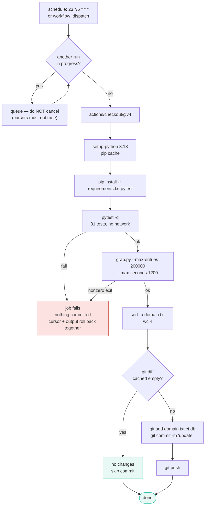

# Flowchart

Diagrams of the pipeline **as it actually runs today**. Rendered with Mermaid.

- [1. Main run](#1-main-run)
- [2. Per-log: two-phase cursor](#2-per-log-two-phase-cursor)
- [3. `fetch_range`](#3-fetch_range)
- [4. Entry handler](#4-entry-handler)
- [5. Cursor state rules](#5-cursor-state-rules)
- [6. CI workflow](#6-ci-workflow)

---

## 1. Main run

Orchestrates logs in LRU order (`updated_at` ascending), re-splitting budget and
time after every log so a fast log hands its share back to the next one.

### `print_coverage`

Two numbers, always printed together. Reading only the first is misleading.

`tree_size − tail_index` is excluded on purpose: re-anchor jumps `tail_index` to
the tip of the tree, so it reads ~100% while actual coverage measured **0.46%**.

---

## 2. Per-log: two-phase cursor

`grab_log`. Tail first (newest entries), backlog second with whatever budget is
left. The critical property: **the cursor is only written when there is real
progress**, so a failed fetch cannot open a hole.

```mermaid
flowchart TD
    Start(["grab_log"]) --> G1{"deadline passed<br/>or budget ≤ 0?"}
    G1 -- yes --> R0["return current cursor<br/>updated_at UNTOUCHED<br/>(log stays first next run)"]

    G1 -- no --> STH["GET /ct/v1/get-sth"]
    STH -- fail --> R0

    STH -- ok --> Tree["tree_size = STH.tree_size"]
    Tree --> ReadCur["read next_index, tail_index"]
    ReadCur --> Clamp{"cursor > tree_size?"}
    Clamp -- tail too big --> ResetTail["tail_index = 0"]
    Clamp -- next too big --> ClampNext["next_index = tree_size"]
    Clamp -- ok --> G2
    ResetTail --> ClampNext
    ClampNext --> G2{"deadline passed<br/>or budget ≤ 0?"}
    G2 -- yes --> R1["return<br/>updated_at UNTOUCHED"]

    G2 -- no --> Desired["desired = min(tail_window, budget)<br/>tail_start = max(tail_index, tree_size − desired)"]

    Desired --> Skipped["skipped = max(0, tail_start − tail_index)<br/>only if tail_index > 0<br/><i>bootstrap history is NOT 'skipped'</i>"]
    Skipped --> Warn{"skipped > 0?"}
    Warn -- yes --> Reanchor["stderr: re-anchor tail:<br/>lewati N entri"] --> HadWork
    Warn -- no --> HadWork["had_work = tail_start < tree_size<br/>or next_index < tail_start"]

    HadWork --> Phase1{"tail_start < tree_size?"}
    Phase1 -- yes --> TailFetch["fetch_range<br/>tail_start → tree_size − 1<br/>budget = full slice"]
    Phase1 -- no --> Phase2

    TailFetch --> TailAdv{"pos > tail_start?"}
    TailAdv -- yes --> TailOk["tail_index = pos<br/>used += n"]
    TailAdv -- no --> Phase2["gap_end = tail_start"]
    TailOk --> Phase2

    Phase2 --> TailOK2{"tail_index > 0<br/>or tail_start ≥ tree_size?"}
    TailOK2 -- no --> Save["bootstrap: backlog HELD BACK<br/>so the gap has exactly one owner"]

    TailOK2 -- yes --> NextCheck{"next_index ≥ gap_end?"}
    NextCheck -- yes --> FastFwd["next_index = max(next_index, tail_index)"]
    NextCheck -- no --> BudgetCheck{"used < budget<br/>and deadline ok?"}

    BudgetCheck -- no --> Save
    BudgetCheck -- yes --> BackFetch["fetch_range<br/>next_index → gap_end − 1<br/>budget = slice − used"]
    BackFetch --> BackAdv["next_index = pos<br/>used += n"]
    BackAdv --> BackCatch{"next_index ≥ gap_end?"}
    BackCatch -- yes --> FastFwd
    BackCatch -- no --> Save
    FastFwd --> Save

    Save --> Commit{"used > 0<br/>or not had_work?"}
    Commit -- yes --> Write["set_cursor<br/>(commits next_index, tail_index,<br/>url, description, updated_at)"]
    Commit -- no --> SkipWrite["do NOT write<br/>failed work → retried first next run"]

    Write --> Ret
    SkipWrite --> Ret["return LogResult<br/used, next_index, tail_index,<br/>skipped, backlog"]

    classDef warn fill:#fff4d6,stroke:#d68910
    classDef err fill:#fde2e2,stroke:#c0392b
    class Reanchor,Warn warn
    class R0,R1,SkipWrite err
```

### Why the backlog does not catch up

Splitting budget to feed the backlog would cost real recall on fresh domains and
buy essentially nothing against 41 billion. See the coverage section in README.

---

## 3. `fetch_range`

Fetches `[start, stop]` inclusively. Two hard guards per iteration: the budget and
the deadline.

> **Fixed in 0.2.0:** the batch was not clamped to `remaining`, so each call
> overshot the budget by up to `batch − 1` entries. `--max-entries` was not a hard
> cap.

Server returning fewer entries than requested is legal (RFC 6962) and is handled:
`pos` advances by the actual count.

---

## 4. Entry handler

`seen` is per-run only, so cross-run uniqueness comes from `sort -u` in CI.

---

## 5. Cursor state rules

The single most important invariant: **cursor and output advance together, or not
at all.**

### Bootstrap safety

---

## 6. CI workflow

`.github/workflows/ct-grab.yml` — cron `23 */6 * * *`, 30-minute job timeout,
`concurrency` group with `cancel-in-progress: false` so two runs never race on
the cursors.

`ct.db` and `domain.txt` are staged in the same `git add`. That is what makes the
rollback consistent — the two must never be committed separately.
